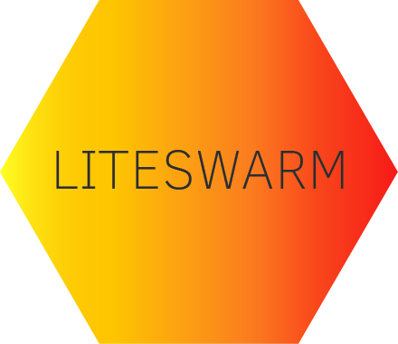
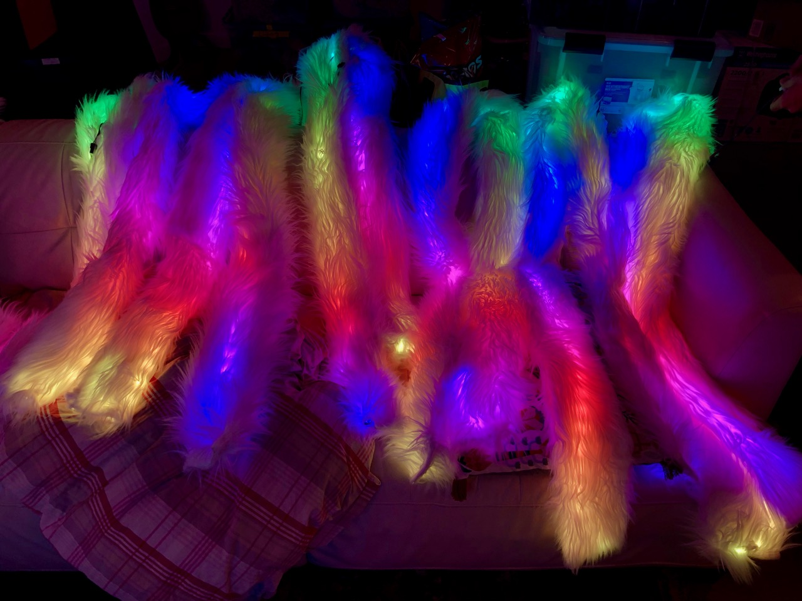

<p align="center">

</p>

## Swarming LEDs for LED Fun
This project can be be applied to many projects. Our prototype has been in scarves. These can also go in all sorts of other places:

- Wearables such as scarves and hats.
- Bike safety helmet.
- Bike lights.

### Why these? What's the swarm?
The thing that makes this project unique is the swarm. We're working to establish a way for multiple projects to communicate so that you can sync up animations with friends or even strangers.



Cheap simple hardware that can be put together in a robust and ad-hoc way to
keep you safe for nights of partying, or bicycling. Keep your friends all in a group with a synchronized mobile light show.

### Materials / Shopping List
These are some of the materials we've used to build our own. You can pretty much bank on them workin for your project.
- [portable battery packs](https://smile.amazon.com/Smallest-Jackery-3350mAh-Portable-Charger/dp/B00L9F95RO/ref=sr_1_8?keywords=jackery+battery+pack&qid=1559954560&s=gateway&sr=8-8), not a bad idea to have two. These are small enough to fit inside of a fuzzy scarf, and they don't turn off on you. You can get a few hours out of one of these... Depends on the animation you run. *mac likes Jackery if you can find 6000-12000mAh capacity for less than $20)
- another batt option [PowerAdd Slim 2 5000 mAh Compact Battery Packs](https://www.amazon.com/dp/B00KG45W08) ($13)
- [fabric](https://www.joann.com/luxury-faux-husky-fur-fabric--white/14387674.html)
- [arduino nanos](https://smile.amazon.com/gp/product/B07HF5RMHV/ref=crt_ewc_title_dp_2?ie=UTF8&psc=1&smid=A278BT9THV444Y)
- [led strips](https://www.aliexpress.com/item/5m-5V-WS2812B-WS2812-Led-Strip-light-Individually-Addressable-Smart-RGB-Led-pixel-strips-Black-White/32995915537.html?spm=a2g0o.cart.0.0.69a03c00Io4CfT)
- moar strips [WS2811](https://hackmd.io/@100ideas/scarfswarm#LED-strips) (see hackmd doc below for links to Ray Wu's led store)
- [usb cables](https://www.amazon.com/HTTX-Straight-Soldering-Connector-Replacement/dp/B07D1HDJM8/ref=sr_1_10?keywords=usb-a+connector+male&qid=1559956539&s=gateway&sr=8-10)
- [rotary encoder](https://smile.amazon.com/DIYhz-Rotary-Encoder-Digital-Potentiometer/dp/B07D3D64X7/ref=sr_1_10?keywords=rotary+encoder&qid=1559955080&s=industrial&sr=1-10)
- [wire](https://www.amazon.com/StrivedayTM-Flexible-Silicone-electronic-electrics/dp/B01KQ2JNLI/ref=sr_1_8?keywords=soldering+wire&qid=1559956794&s=gateway&sr=8-8)
- [nRF24L01+ 2.4 Ghz radio](http://a.co/d/3rhLgCT)
- Bourns PEC11 12mm 24-pulse rotary encoder (PEC11-4215F-S24) [adafruit #377](https://www.adafruit.com/product/377) ($4.50/1); [datasheet](https://cdn-shop.adafruit.com/datasheets/pec11.pdf) (need 10x)
- [usb type a male adapter 20-pack]( https://www.amazon.com/gp/product/B07GGJGB7Q) ($11) (for making power cables)
- [JST 4pin male-female connector pigtails, pack of 20](https://www.amazon.com/gp/product/B075K3M1TB) ($11)
- [112Pcs 2.54mm Male and Female Pin Header Connector Assortment Kit, 100pcs Stackable Shield Header](https://www.amazon.com/gp/product/B07CWSXY7P) ($13)
- [Capri Tools 20011 Automatic Wire Stripper and Cutter
](https://www.amazon.com/gp/product/B01018CX46) ($14) - get one. changed my life.

[
Scarfswarm / bikelights Big Red animation demo (youtube 2m)](https://youtu.be/5sAtdrZpyJc)

## Contributing
### Getting Involved
If you'd like to submit a bug, go ahead and use the issue tracker.

If you'd like to make submit a feature or a fix.
  - Open an issue to get buy in.
  - Fork the repo.
  - Make your changes.
  - Submit a pull request.

### Troubleshooting
Things you might be missing.
- edit using VSCode with PlatformIO plugin
- OpenOCD some USB stuff `brew install openocd` (or else `dyld: Library not loaded: /usr/local/opt/libftdi/lib/libftdi1.2.dylib`)

## Reference
**project documentation** https://hackmd.io/@100ideas/scarfswarm

libraries we're using:
- [FastLED.h](https://github.com/FastLED/FastLED) let their be light
- [NRFLite.h](https://github.com/dparson55/NRFLite) ... longwave light
- arduino / teensy [SPI](https://www.pjrc.com/teensy/td_libs_SPI.html) library
- [Encoder](https://github.com/PaulStoffregen/Encoder) - performant quadrature encoder for rotary inputs
- 

---

## 2019-12-12 Teensy-LC + NRF24L01+ notes

teensy forum faq: https://forum.pjrc.com/threads/25395-Teensy-Quick-Reference-Code-Examples-Tips-and-Tricks?highlight=nrf24l01
- also see
  - getting 128-bit ID hardcoded into chip
  - interval timer using interrupts
  - simple task library
  - libs https://www.pjrc.com/teensy/td_libs.html
    - debounce
    - timers

Optimized High Speed NRF24L01+
- https://tmrh20.github.io/RF24/
- mentioned on pjrc forums https://forum.pjrc.com/threads/40499-Need-to-change-SPI-clock-rate-for-RF24-radio-modules-w-TMRh20-library


NRF24L01+ w/ amazon breakout boad diagram
-----------------------------------------------------------------------------------------------

                                                 (pins)       NRF24L01+ breakout board pcb
    | nrf:teensy pin# | nrf:teensy     |      |-----------------------------------------------|
    | --------------- | -------------- |      |[1] | 2  |                      (antenna)      |
    | 1: GND   GND    | 2: VCC  (+3.3v)|      | -- | -- |        -------     ===============  |
    | 3: 9     CE     | 4: 10?  CSN    |      | 3  | 4  |        | C H |        ||   -----||  |
    | 5: 13    SCK    | 6: 11   MOSI   |      | -- | -- |        | I P |        ||   ||-----  |
    | 7: 12    MISO   | 8: ?    IRQ    |      | 5  | 6  |        -------        ||   -----||  |
                                              | -- | -- |                       ||   ||-----  |
                                              | 7  | 8  |                       ||   -----||  |
    Functions as follows:                     |---------|                            ||-----  |
    1: Ground                                 |         ( 16.000 )                        ||  |
    2: Vcc (3.3v)                             |-----------------------------------------------|
    3: CE (Chip Enable)
    4: CSN (Chip Select Not) Active Low - SPI Chip Select function
    5: SCLK (Clock) - SPI Clock Function
    6: MOSI (Master Out Slave In) - SPI Data
    7: MISO (Master In Slave Out) - SPI Data
    8: IRQ (Interrupt) - Optional, but goes low to indicate that data has arrived, fault has
       occurred, or write buffer full.

> SPI has 4 signals: **SS**, **SCK**, **MOSI**, **MISO**. SCK is a clock signal. Master Out Slave In (MOSI) sends data from the SPI master to one or more slaves. Master In Slave Out (MISO) is how slaves send data back to the master. To talk to only one of several slaves, the Slave Select (SS) pin is used. Thus, some chips need only 3 or even 2 of these signals; a display, for example, will use MOSI but not MISO, as it is an output only device.
>
> Multiple SPI devices use the same SPI SCK, MISO and MOSI signals but each device will need it's own SS pin.

| Signal | Function      | Teensy 2.0 | Teensy++ 2.0 | Teensy 3+ / LC * | ALT Teensy 3+ / LC |
| ------ | ------------- | ---------- | ------------ | -------------- | ------------------ |
| SS     | Select device | 0          | 20           | 10             | -                  |
| SCK    | Clock         | 1          | 21           | 13             | 14                 |
| MOSI   | Data Output   | 2          | 22           | 11             | 7                  |
| MISO   | Data Input    | 3          | 23           | 12             | 8                  |

\* these pins are set by default by SPI library(?). To use ALT, make calls to `SPI.setMOSI(pin)` etc.

> However, the SS pin must either be configured as an output, or if it is an input, it must remain low during the SPI transfer. Unconfigured pins default to input, and a pin with no signal can easily "float" to random voltages due to electrical noise. Always configure the SS pin as an output, or make sure it remains low.
>
> Sometimes, the SPI pins are already in use for other tasks when an SPI device is added to a project. If that task is simply a digital pin, or an analog input, it is usually better to move that to another pin so that the hardware SPI can be used. Sometimes though, the conflicting pin cannot be moved. The Audio Adapter, for example, uses some of the SPI pins to talk to the Audio DAC over I2S. For this case, Teensy 3.x provides an alternate set of SPI pins.
>
> The main SPI pins are enabled by default. SPI pins can be moved to their alternate position with SPI.setMOSI(pin), SPI.setMISO(pin), and SPI.setSCK(pin). You can move all of them, or just the ones that conflict, as you prefer. The pin must be the actual alternate pin supported by the hardware, see the table above; you can't just assign any random pin.

https://www.pjrc.com/teensy/td_libs_SPI.html

-----------------------------------------------------------------------------------------

## dont overflow if counting packets...
how many packets (max) could a device see per second?
```
(800kbps * 1 second) / 32 bytes = 3125
(2MBps * 1 second) / 32 bytes   = 62500
```
see UINT_MAX from std::numeric_limits 
- https://en.cppreference.com/w/cpp/types/climits
- https://en.cppreference.com/w/cpp/types/integer

| uint sizes | atmel / arduino | teensylc arm cortex M0 |
| ---------- | --------------- | ---------------------- |
| INT8_MAX   | 127             |                        |
| UINT8_MAX  | 255             |                        |
| INT16_MAX  | 32767           |                        |
| UINT16_MAX | 65535           |                        |
| INT32_MAX  | 2147483647      |                        |

```c
// https://www.badprog.com/c-type-what-are-uint8-t-uint16-t-uint32-t-and-uint64-t

// testValue
unsigned long long testValue     = 0xFFFFFFFFFFFFFFFF; // 18446744073709551615

// 1 byte -> [0-255] or [0x00-0xFF]
uint8_t         number8     = testValue; // 255
unsigned char    numberChar    = testValue; // 255

// 2 bytes -> [0-65535] or [0x0000-0xFFFF]
uint16_t         number16     = testValue; // 65535
unsigned short    numberShort    = testValue; // 65535

// 4 bytes -> [0-4294967295] or [0x00000000-0xFFFFFFFF]
uint32_t         number32     = testValue; // 4294967295
unsigned int     numberInt    = testValue; // 4294967295

 // 8 bytes -> [0-18446744073709551615] or [0x0000000000000000-0xFFFFFFFFFFFFFFFF]
uint64_t             number64         = testValue; // 18446744073709551615
unsigned long long     numberLongLong    = testValue; // 18446744073709551615
```

## deviceId collisions
calculate liklihook of id collisions, where n = number of devices & d = keyspace size (using birthday problem formula):

1 - (d!) / ((d - n)! * d^n)

n = 10 devices
d = 256 (uint_8)
p = 16%

n = 10 devices
d = 32768 (uint_16)

### 2019-11-21 dev notes for scarfquest
intellisense not picking up uintxx types from `/Users/100ideas/.platformio/packages/toolchain-atmelavr/avr/include/stdint.h`